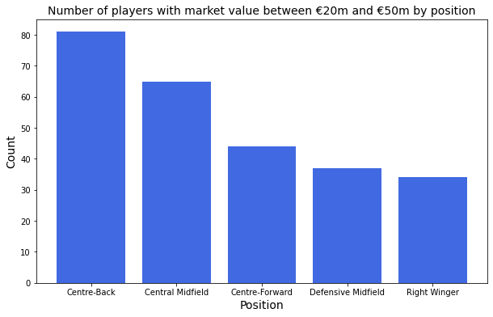

# Factors Influencing the Market Value of Football Players

The purpose of this project is to visualize the factors that influence the market value of football players.

Three datasets from Kaggle were used:

1. Football Data from Transfermarkt: CSV file that contains up-to-date data on the market
value of players from the website www.transfermarkt.co.uk and other information such as the
player’s club, the league he plays in, etc.

2. Football Summer Market: CSV file that contains information about players that transferred
to new clubs in the summer of 2023, such as the transfer fee and their old and new clubs.

3. 2022-2023 Football Player Stats: CSV file that contains the previous season’s (2022/23) statistics on players in the Big Five European leagues. These are the Premier League in England,
La Liga in Spain, Serie A in Italy, Bundesliga in Germany, and Ligue 1 in France.

The Python code involves cleaning the data into an appropriate format for data visualization.

## Results

1. Players from England, France and Spain are the most expensive.
2. The most expensive players are attack-oriented.
3. The market value of players peaks at approximately the age of 24.
4. There is a tremendous influx of wealth in the Premier League. It outsepnt every other major league in Europe in the summer of 2023 by a huge margin.

*Figure 1: Top 10 countries with the most valuable players.*

*Figure 2: Top 6 leagues with highest transfer fee spending in summer of 2023*

*Figure 3: Net transfer fee spending by league in summer of 2023*

*Figure 4: Number of players with market value between €20m and €50m by position*

*Figure 5: Number of players with market value between €50m and €100m by position*

*Figure 6: Number of players with market value over €100m by position*

*Figure 7: Scatter plot of Player Market Value vs. Age*

